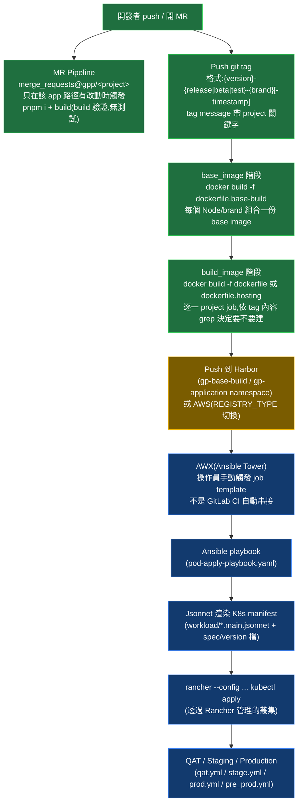
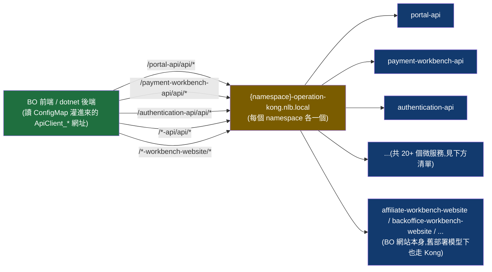
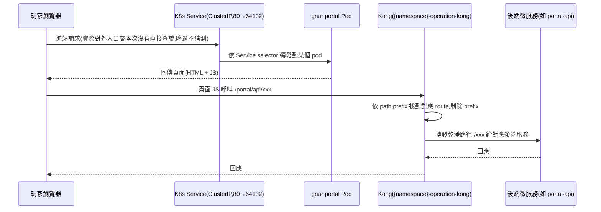

# 公司專案筆記 — 架構演進史 + CI/CD + K8s/Kong 流程

> 建立日期:2026-08-31
> 用途:公司專案(backroom / arena / gnar)的架構脈絡 + CI/CD 流程 + K8s/Kong 運作備忘,幫助記憶、分享用。學習路線圖拆到 [ROADMAP.md](./ROADMAP.md)。
> 標示慣例:✅ 已查證(翻過 git log / commit / 檔案內容確認過)、🗣 記憶,未查證(純粹憑印象,沒有或無法找到證據佐證,分享時請自行斟酌措辭)。

---

## Backroom 架構演進史(2026-08-31 整理)

> 給分享用的備忘,免得之後忘記脈絡。

### 0. 最初期 — 前後端同專案、多個獨立專案並存(🗣 記憶,未查證)

backroom 這個 git repo 誕生(2023-05)之前的年代。當時前後端是**同一份專案**,裡面會有一個專門給前端的 website 資料夾。整個 BO 由**非常多個獨立專案組成**,每個專案版本可能都不一樣。另外有一份共用 component,自己獨立成一個專案,打包後放到雲端的私有 package registry(見下方確認是 ProGet)。因為當時 Vue2 / Vue3 並存 + 各專案 Node 版本不一致,前人維護的共用 component 最後演變成**好幾種專案 package 版本並存**(不同 app 卡在不同版本,沒辦法全部升上去)。

這段沒有 git 證據可查(backroom repo 本身就是從別處把多個既有專案搬進來的那一刻才開始有記錄),完全依賴記憶,分享時建議註明是回憶轉述。

### 1. 共用元件的雲端 package registry — ProGet(✅ 已查證存在,🗣 起始時間未查證)

確認 `https://proget.higgstar.com/npm/npm-dev/` 是真實存在、被使用過的私有 npm registry(ProGet 是一款商用的私有套件管理服務,支援 npm / NuGet 等多種套件類型)。backroom repo 最早的 commit(2023-05-30)裡,`Higgs.Cs.Website` 的 `package.json` 就已經依賴 `@higgs/utils@1.2.11` 這個 scoped 私有套件 — 版號已經到 1.2.11,代表在 backroom repo 誕生前,這個共用套件就已經存在一段時間、發過不少版本。

git history 裡明確抓到的 ProGet 相關 commit 只有較晚的兩筆:
- `ce4a9252` / `1ec76e55`(2024-11-01)— 把 `registry=https://proget.higgstar.com/npm/npm-dev/` 加回根目錄 `.npmrc`
- `a89ac945` / `96ebbe26`(2025-03-28)— 移除(`alpha.chen/ref/remove-proget`)

這兩筆的時間點比「最初期」晚很多,推測是 ProGet 的 registry 設定原本沒有 commit 進這個 repo(可能放在 CI runner 或開發機的環境層級,不是 committed `.npmrc`),2024-11 那次是重新接回來、2025-03 又拔掉。**這一段落的確切起始時間跟前後脈絡,目前查不到更早的 git 證據**。

現在部分共用套件(如 `@higgs/vue-package`)改用**本地 tarball**(`file:../../../packages/store/higgs-vue-package-0.4.3.tgz`)引用,不再依賴外部 registry — 這應該是 ProGet 退場後的替代做法,但沒有逐一確認是否所有共用套件都改成這個模式。

### 2. 前後端分離 + Monorepo 化(✅ 已查證)

backroom 這個 git repo 建立於 **2023-05-29**(`b668f444`,只有一份 README)。隔天(**2023-05-30**)第二筆 commit「add operation projects」一次把三個既有專案(`Higgs.Backoffice.Workbench.Website`、`Higgs.Crm.Workbench.Website`、`Higgs.Cs.Website`)搬進來,每個底下已經有 `kto/` 子資料夾 — 證實「先全部丟進 backroom,裡面又分 sp/kto」這個階段,一開始就是**單純搬家**,把原本散落各處的獨立前端專案集中到同一個 monorepo,還沒有特別做 CI/CD 調整。

### 3. CI 補上(✅ 已查證,跟 Node 版本調整幾乎同一天)

`.gitlab-ci.yml` 是在 **2023-08-23** 才加進來的,比 monorepo 誕生晚了近 3 個月 — 確認「搬進來那一刻 CI 還沒跟上,是後來才補的」這個印象。同一天/隔天(2023-08-23~24)還有一筆「upgrade project to node 16 version」(`KTO-6041`,注意 ticket prefix 是 `KTO-`,一個比 `SP-` 更早的獨立 Jira project),兩者時間點幾乎重疊,看起來是同一波「先讓 CI 能跑起來」的工程一起做的。

### 4. Node 版本 + Element Plus — 沒有單一統一計畫,是長期陸續升級(✅ 查證「沒有單一計畫」,🗣 現況細節為記憶)

git history 裡**找不到一筆明確的「統一 Node 版本」計畫性 commit**(沒有 `.nvmrc`、沒有符合關鍵字的規劃性 commit),Element Plus 的採用也一樣,是分散在大量小 commit 裡逐步做的,沒有單一起手式時間點。這跟你的記憶吻合:「隔一段時間就慢慢升,不是一次性計畫」。目前現況(依你回憶)大概是設定 Node 16 以上都能跑;實際抽查現有幾個 app 的 `package.json` `engines` 欄位,確實還有多個 app 寫死 `>=16.0.0 <17.0.0`,但這只是 metadata 抽樣,不能代表全貌(可能有些 app 實際執行環境已經更新、只是 `engines` 欄位沒同步)。

### 5. Jira 專案 key 演進(✅ 已查證)

比記憶中更複雜,目前查到至少 4 個 prefix 前後出現過:`KTO-`(最早)→ `SP-` → `PD-`(偶爾出現)→ `GS-`(現行)。**`SP-` → `GS-` 的乾淨切換點是 2025-07-16~18**(`SP-9135` 是最後一筆 SP,`GS-450` 緊接著是第一筆 GS)。是否有經歷過「搬到 GitLab」這個階段沒有辦法確認 —— backroom repo 從最早的 commit(2023-05)開始就已經看得到 GitLab MR merge 記錄(第三筆 commit 就是一個 MR merge),代表這個 repo 從有記錄以來就已經在 GitLab 上,如果真的有「搬到 GitLab」這件事,應該是發生在 backroom repo 誕生之前、更早期分散專案的年代。

### 6. 近期 — CD 架構大改造(✅ 已查證,這幾週正在進行中的工作)

這是我們自己正在做的,不用查 git log,直接記錄:近期(2026-05 起)在做的「code merge」系列(`GS-5954` 這張大票),目標是把 backroom 各 app 內殘留的 `kto/` `sp/` 雙 codepath 合併成單一 source tree,搭配一個新的**per-project pod** 部署架構(每個 project 一個 pod,base image + artifact 疊層,Kong 依 path 分流,不再是「一個 tenant 一份獨立部署」)。子票包含 Marketing(`GS-5959`,已完成)、CS(`GS-6009`,進行中)、Backoffice(`GS-6008`)、Maintenance(`GS-6010`)。這一段是目前 CD(部署)架構的主要調整,跟前面「補 CI 讓它能跑」是完全不同層次的工程 — 前面是「有沒有」,這次是「怎麼部署得更聰明」。**這個新架構的完整 CI/CD 細節見下方「前端 CI/CD 完整流程」章節。**

---

## Backroom 完整時間軸(嚴格照日期排序,更細節版)

> 上面第一版是「主題分段」寫法,這版是純時間軸,方便照順序講故事。同樣標示 ✅/🗣。日期均為 commit 日期(`git log --date`),不是實際上線日。

| 日期 | 事件 | 證據 |
|---|---|---|
| (2023 之前) | 前後端同專案、多個獨立專案並存;共用 component 獨立成一個專案發版到 ProGet;Vue2/Vue3 + Node 版本不一致導致共用套件分裂成多個版本並存 | 🗣 記憶,無法查證(backroom repo 誕生前的歷史,不在這個 repo 的記錄範圍內) |
| 2023-05-29 | **backroom repo 誕生**(只有一份 README) | ✅ `b668f444` Initial commit |
| 2023-05-30 | 第一波搬家:`Higgs.Backoffice.Workbench.Website`、`Higgs.Crm.Workbench.Website`、`Higgs.Cs.Website` 三個既有專案整包搬進來,**已經帶著 `kto/` 資料夾**;同時新增 `.npmrc`,`@higgs/utils@1.2.11`(私有共用套件,搬進來時版號已經很成熟)已經是既有依賴 | ✅ `bcfefa4f` add operation projects |
| 2023-06-14 | **Payment 模組最早完成 kto+sp 合併**(目前查到最早的單一模組合併案例,比後來的系統性專案早了將近 3 年) | ✅ `6808ea4c` SP-2747 \| 合併KTO, SP payment project |
| 2023-08-23~24 | 補上 `.gitlab-ci.yml`(monorepo 誕生近 3 個月後才有 CI)+ 同時間一筆 Node 16 升級(`KTO-` 這個更早期的獨立 Jira project) | ✅ `.gitlab-ci.yml` 建檔 commit;`90433c70`/`780641c4` KTO-6041 upgrade to node 16 |
| 2024-11-01 | ProGet registry(`https://proget.higgstar.com/npm/npm-dev/`)被加回根目錄 `.npmrc`(推測是重新接回,不是第一次設定) | ✅ `ce4a9252`/`1ec76e55` |
| 2025-03-28 | ProGet registry 從 `.npmrc` 移除 | ✅ `a89ac945`/`96ebbe26` remove proget registry |
| 2025-07-16~18 | **Jira project key 由 SP- 切換到 GS-**(乾淨切換,`SP-9135` 是最後一筆 SP、`GS-450` 緊接著第一筆 GS);歷史上還出現過 `KTO-`(更早)、`PD-`(偶爾)兩個 prefix | ✅ ticket 序列分析 |
| **2026-02-03** | **「Deprecated KTO brand」**——一次性把 Affiliate、Audit、Crm 等多個 app 的 `kto/` 資料夾清空(git-tracked 檔案數歸零)。這是一個**獨立的品牌退場事件**,推測跟後面 GS-5954 系列不是同一件事:這裡砍掉的 KTO 應該是一個真的不再服務的品牌,跟現在還在服務中的 WB 品牌(WB 在 code 裡也長期借用 `kto` 這個資料夾命名,是命名沿用不是同一個品牌)是兩回事——這段推論沒有 100% 查證,只是目前證據最合理的解讀 | ✅ `GS-4423` Deprecated KTO brand(commit 日期);folder 現況交叉比對 |
| 2026-05-11 | **`GS-5954` 立項**——「backroom code merge & SSR PoC」,拍板 per-project pod 部署架構(base image + artifact 疊層、Kong path 分流),目標把還在服務 WB 品牌的 app(跟上面 2026-02 退場的 KTO 不同)的 `kto/sp` 合併成單一 tree | ✅ plan frontmatter `created: 2026-05-11` |
| (2026-05~06) | Marketing(`GS-5959`)完成合併,是 GS-5954 系列第一個做完的模組 | ✅ plan「已完成」列表(未逐一查 commit 日期) |
| 2026-07-30 | Backoffice(`GS-6008`)kto/sp 合併樹完成 + forward-port master | ✅ `092a267a` GS-7618 |
| 2026-08-11 | **Maintenance Workbench 直接退役**(不是合併!整包搬到 `deprecated/`,k8s/nginx 層另外處理)——這是 GS-5954 系列裡唯一一個「不合併、直接退場」的模組 | ✅ `8fef2713` GS-7621 |
| 2026-08-12 | **Backoffice 兩段式改名成 Hub**(同一天做完):先 `apps/Higgs.Backoffice.Workbench.Website` → `apps/Hub`(package 也改 `@gpp/hub-sp`),幾小時後再從 `apps/Hub/sp` → `apps/hub/generic`(理由是這包早就不是 sp 專屬 build 了——CI 本來就用 `BUILD_BRAND=sp`/`wb` 兩種參數各 build 一次同一包,folder 掛著 sp 名字反而誤導) | ✅ `42f69cac` GS-7317 rename;`cfdaa14f` GS-7895 move to apps/hub/generic(commit 訊息直接寫了改名理由) |
| 2026-08-19 | CS 模組改名:`apps/Higgs.Cs.Website/sp` → `apps/cs/generic`,package `@gpp/cs-sp` → `@gpp/cs`(GS-6009 的一部分,新架構命名規則:app 名小寫、統一叫 `generic`——跟 Hub 是同一套改名邏輯) | ✅ `bca11424` GS-6009 cs rename |
| 2026-08(進行中) | CS(`GS-6009`)kto/sp 合併工作進行中,尚未完全結束 | ✅ 這幾天我們自己在做的事,不用查 git log |
| 尚未開始 | IT-Operation(`GS-6030`)還沒動,目前查到 git 上還有 240 個 kto 檔案完整存在 | ✅ 直接檢查 git-tracked 檔案數確認 |

**額外發現,原本沒問過你、但值得記錄**:

1. 目前 `apps/` 底下同時存在舊命名(`Higgs.XXX.Workbench.Website`)跟新命名(`cs`、`hub`,小寫、底下都是 `generic` 資料夾)兩種風格並存 —— 代表新架構的搬遷是**逐一模組進行**,不是一次性重新命名全部,搬到新架構的模組才會換成新命名規則。目前只有 CS、Hub(即前 Backoffice)兩個模組換了新命名,Payment 目前還是掛著 `Higgs.Payment.Workbench.Website` 舊名,還沒被搬(原本記憶中以為 Payment 也有新命名,查證後發現沒有,修正)。
2. 有個獨立的 `deprecated/` 資料夾,專門收「合併完成後」被取代的舊 `kto/` 資料夾(整包搬過去,不是刪除),命名規則是 `<原App名>.Kto`。目前裡面有 Affiliate、Audit、Backoffice(即 Hub)、Crm、Cs、Marketing、Payment、Report 八個 `.Kto`,代表這八個模組的 kto/sp 合併都已收尾;`Maintenance` 是整包(不加 `.Kto` 後綴)被丟進 `deprecated/`,因為它是退役不是合併(呼應前面表格 2026-08-11 那筆)。
3. Kyc、RiskControl 兩個模組經查證**從頭到尾就沒有 `kto/` 資料夾**(整個 git history 都查不到),代表它們一開始就是 SP 單一租戶 app,根本不屬於「kto/sp 合併」這個故事線,不用特別去追它們的合併進度。
4. 目前唯一還沒動的是 `Higgs.It.Operation.Website`,`kto/` 底下還有 240 個檔案,對應前面表格「尚未開始」那筆(`GS-6030`)。

---

## 前台(玩家端)架構演進史 — arena → gnar

> 你的原始記憶:「一開始是 portal、brand-component、cs-component 三個組成在一起,後來用 arena 把它們丟起來一起管理,最後重構成 gnar 一個專案處理全部」。查 arena + gnar 兩個 repo 的完整 git log 後,骨架完全對上,而且挖到比記憶更細的日期跟幾個記憶沒提到的東西(下面有標)。

### 時間軸

| 日期 | 事件 | 證據 |
|---|---|---|
| 2024-07-09~10 | **arena repo 誕生**,但誕生時原名其實是 `portal`——第一個 commit 的 README 就寫「# portal」,根目錄 `package.json` 的 `"name"` 欄位到現在都還是 `"portal"`,從沒改過(GitLab 專案後來被改名成 `arena`,但這個改名是 GitLab 專案設定層級的事,git log 裡看不到確切時間點,repo 內部這兩個檔案就是沒跟著更新,算是一個活化石) | ✅ `40e2abf` Initial commit;`git remote -v` 現在指向 `.../frontend/arena.git`,但 `package.json`/`README.md` 內容仍是 `portal` |
| 2024-07-10~11 | `Higgs.Portal.Promote.Website`(推廣/活動微站,你原本沒提到的第 4 個)很早就進來了,看起來是 arena 自己原生的內容,不是後面「搬 3 個專案進來」那批 | ✅ 位於最早幾筆 commit 附近 |
| 2024-07-31 | **Portal 本體**(原專案名 `sp-portal-web`)+ **Affiliate** 同批搬進 arena,落地成 `apps/portal`、`apps/affiliate` | ✅ `5ef4e14`/`e23eede` SP-5982~5985「move project and adjust ci config」/「sp-portal-web 轉 gitlab runner」 |
| 2024-08-01 | **brand-cs-component**(你記憶中的 cs-component)搬進來,落地成 `apps/brand-cs` | ✅ `8160628` SP-5988「brand-cs-component 轉 gitlab runner」 |
| 2024-08-06 | **brand-component** 搬進來,落地成 `apps/brand` | ✅ `98f373c` SP-5986「brand-component 轉 gitlab runner」 |
| 2024-08-08 | 三個專案搬遷收尾(CI 路徑、build 變數等細節調整) | ✅ `d59a58f` SP-5987「move project into repo」 |
| 2024-08-13 | **改成你記憶中的最終名字**:`apps/brand` → `apps/brand-components`,`apps/brand-cs` → `apps/cs-components`(同一筆 commit 一次做完) | ✅ `338a097` SP-5989「rename project name」 |
| 2024-08~2026-02 | arena 以「一個 repo、四個 app(portal / affiliate / brand-components / cs-components)」的形態運作超過一年半,期間也跟著 backroom 一起經歷 Jira project key `SP-` → `GS-` 的切換 | ✅ commit 序列交叉比對(與 backroom 段落同一波切換) |
| 2026-02-05 | `Higgs.Portal.Promote.Website` 隨 **KTO 品牌退場**被移除——跟 backroom 段落記錄的 2026-02-03「Deprecated KTO brand」是**同一波跨 repo 行動**,只差 2 天,backroom 先做、arena 晚 2 天跟進 | ✅ `8dfe249` GS-4423「Deprecate KTO related code」 |
| **2025-09-12** | **gnar repo 誕生**——這件事跟上面 arena 的故事線是**平行的、不是接續的**:gnar 不是把 arena 的 code 搬過來,是**全新從零開始**,第一批 commit 就是「Portal1.5」重寫計畫(新技術棧 Astro + Vue3,取代 arena 那個舊 Vue2 portal) | ✅ `a958bcdd` Initial commit,緊接著 `GS-1684`/`GS-1681`/`GS-1676`(footer / privacy / landing page)等 Portal1.5 sub-task |
| 2025-10-09 | gnar 建立自己的共用元件系統 **`packages/boom`**(基於 Lit,支援 Vue/React/原生 JS 跨框架),整合進 portal——這概念上接手了 arena `brand-components` 的角色,但**不是搬程式碼過去,是重新造**一套 | ✅ `ec4449f6` GS-2382「initialize boom lit package and integrate to portal」 |
| 2026-04-27~06-23 | **GS-5646「Portal migration(arena → gnar)」**——把 arena portal 的功能一項項移植進 gnar 的新 Astro 殼,8 週計畫,整合分支 `alpha.chen/feat/GS-5648`,06-23 單次跟其他團隊一起上線 master(這段細節在 requirements repo 自己的 rule 檔裡有完整記錄,不用重挖) | ✅ `requirements/.claude/rules/gs5646-integration-branch.md`(rule 檔本身) |
| 2026-06-11 | gnar `packages/store` 加了一個 **`cs-umd-bridge`**——過渡期用的橋接機制,讓 gnar 頁面能暫時繼續叫 arena 那邊還沒搬過來的 CS 元件(UMD 包、只服務 SP 一個品牌),等真正的 CS 遷移完成前的權宜之計 | ✅ `307ee9f6` GS-5646「cs-umd-bridge — interim SP-only UMD tenancy serving」 |
| 2026-06-17~07-16 | arena 的 `apps/portal` 實質上凍結(最後一筆只是 lockfile 層級的東西);`brand-components` 也差不多同期停更;`cs-components` 撐到 07-16 補了一個資安修復才停 | ✅ 各 app 資料夾 `git log -1` 交叉比對 |
| **2026-08-11~08-14** | **CS-components 真正遷進 gnar**——`GS-8148`「CS 遷移至 gnar(KTO/WB)+ multi-brand 化」這個 epic,子票 GS-8209(抽成 `packages/cs`)→ GS-8213(`apps/call-center` 落地,WB CS 站上線)。這件事發生在**這個月**,幾乎是最新鮮的一塊拼圖 | ✅ `7cda08e0` GS-8209、`0c0f516b` GS-8213;`requirements/GS-8148/GS-8148-plan.md` |
| 2026-07-31 | (旁支,跟上面故事不同線但也是 gnar「處理全部」的一部分)gnar 多了 `apps/backroom-hosting`(前身叫 `backroom-pod`)——gnar 現在也負責 host **backroom(BO)** 的 pod 產物,呼應前面 backroom 段落記的 per-project pod 部署架構,也是下方 CI/CD 章節「新版 per-project pod 部署」的服務層來源 | ✅ `7597bb70` GS-7893「rename backroom-pod → backroom-hosting」 |
| **現在(2026-08-31)** | gnar 目前是 `apps/portal`(玩家 portal)+ `apps/call-center`(CS 客服站)+ `apps/backroom-hosting`(BO pod 託管)+ 4 個共用 package(`boom` UI 元件 / `cs` / `kits` / `store`) | ✅ 直接 `ls apps/ packages/` |

### 跟你原本記憶對照一下,有一個修正

你說「最後重構成 gnar 一個專案處理全部了」——**目前查證下來還沒到「全部」**:arena 的 `apps/affiliate` 到 2026-07-01 都還有人在加功能(`GS-7100` 加 E-Bingo/Specialty 報表),gnar 這邊完全沒有對應的 affiliate app(只有 portal 裡一個處理推薦碼的 middleware,跟「代理後台」不是同一件事)。也查了 requirements repo 裡目前所有跟「affiliate」+「gnar」相關的票,都只是「這張票跟 arena affiliate 無程式交集」這種備註,沒看到任何遷移計畫在排。所以現況比較準確的說法是:**Portal 已完成遷移(GS-5646)、CS 剛完成遷移(GS-8148,這個月)、Affiliate 還留在 arena,沒有遷移排程**——arena 還沒能真正退役,還有一塊(affiliate)在單獨活著。

🗣 你補充:affiliate 比較特別,還沒決定好要怎麼處理,但未來高機率也會丟進 gnar(這段是你的判斷,還沒有對應的 Jira 票或 plan 文件可查證,先記錄成待驗證的方向)。

---

## 前端 CI/CD 完整流程(2026-08-31 整理)

> 你的記憶:「最原本是用 Jenkins,後來才改成用 GitLab」。查了 backroom / arena / gnar 三個 repo 的完整 git log,以及專門的 K8s 部署 repo(`kubernetes-deployment`),把整條「commit → CI build → image → CD deploy → K8s」的鏈路挖出來了,細節比原本印象豐富不少。下面先講 Jenkins→GitLab 這段轉換,再講**現在**完整的 CI/CD 是怎麼運作的。

### 一、Jenkins → GitLab CI 的轉換

🗣 **Jenkins 那一段本身,查無直接證據**——backroom / arena / gnar 三個 repo 目前能看到的最早歷史,都是「一堆各自獨立的舊專案被『搬進』一個新 monorepo」的那一刻才開始有記錄(backroom 2023-05、arena 2024-07 各自都是這樣)。如果 Jenkins 真的存在過,那是發生在被搬進 monorepo **之前**的舊 repo 裡,那些舊 repo 沒有本地存取權,查不到 git log。

✅ **間接佐證,支持你的記憶方向**:arena 裡幾個專案搬遷當下的 commit message,直接寫的就是「**轉 gitlab runner**」:

- `SP-5983`(2024-07-31)「sp-portal-web 轉 gitlab runner」
- `SP-5986`(2024-08-06)「brand-component 轉 gitlab runner」
- `SP-5988`(2024-08-01)「brand-cs-component 轉 gitlab runner」

而且都是在該次搬遷才**第一次**新增 `.gitlab-ci.yml`。「轉」這個字本身就暗示「從別的東西換過來」,方向跟你的記憶一致,只是「別的東西」具體是不是 Jenkins,git log 裡看不到直接證據——只能列為 🗣。

**結論**:GitLab CI 全面接手前端 CI,查證到的時間點是 **2024 年 7-8 月**(至少對 portal / brand-component / cs-component 這幾個 app 是這樣)。backroom 那邊因為 2023-05 搬進來時 CI 還沒補上,`.gitlab-ci.yml` 是晚 3 個月後的 2023-08-23 才加的,時間點更早一點,但一樣是「搬進 monorepo 之後才第一次有 CI 檔案」的模式,推測背後故事類似。

### 二、現在的 CI(build 階段)—— 以 backroom 為例,✅ 已查證(2026-08 現況)

**節點說明**:

| 節點 | 說明 |
|---|---|
| MR Pipeline | `.gitlab-ci.yml` 的 `merge_requests` stage,每個 app 一個 job(如 `merge_requests@gpp/cs`),用 `changes:` 路徑過濾,只在對應 app 的檔案有改動時才跑。內容是 `pnpm --filter <pkg> i` + `BUILD_BRAND=sp pnpm --filter <pkg> build`——**只驗證 build 過不過,沒有跑任何測試**(呼應 ROADMAP 裡 Testing 是空白這件事) |
| Tag 觸發 build | 監控到的實際 tag 例:`2.0.93-release-sp`(正式版)、`2.0.93-beta-wb-2026083104`(beta,帶時間戳)、`2.0.93-test-sp-2026082702`(測試版)。`build_image` stage 的每個 job 有 `rules: if CI_COMMIT_TAG =~ /.*(sp).*/ && CI_COMMIT_TAG_MESSAGE =~ /.*<project>.*/`,monorepo 用這個機制讓一個 tag 只觸發真正相關的 app 建 image,不會把幾十個 app 全部重建 |
| base_image / build_image 兩階段 | 先建一份共用的「Node 版本 + 系統依賴」base image(如 `backoffice-16-0`),再用它當 FROM 建每個 project 自己的 image——避免每個 app build 都重新裝一次 Node/系統依賴,加速建置 |
| dockerfile vs dockerfile.hosting | **兩套部署模型並存**(下方「三」細講):`dockerfile` 是舊模型,把 build 產物交給一個 dotnet 網站透過共用 PVC 掛載去服務;`dockerfile.hosting`(GS-7893)是新的 per-project pod 模型,直接把產物烤進 image 裡,用 gnar 那邊建的 `backroom-hosting` base image 直接服務,不需要 volume / rsync |
| Harbor / AWS 雙註冊表 | Image push 目標由 `REGISTRY_TYPE` 變數決定走 Harbor(`harbor.higgstar.com`,私有 container registry)或走 AWS(`AWS_CONFIG`),看環境而定 |
| AWX → Ansible → Jsonnet → Rancher | **這是跟 GitLab CI 完全分開的獨立系統**——GitLab CI 只做到「build image + push registry」為止,`.gitlab-ci.yml` 裡完全沒有 deploy stage,也沒有呼叫 AWX 的痕跡。實際部署是操作員在 **AWX**(Ansible Tower 的網頁介面)手動跑一個 job template,底層執行 `kubernetes-deployment` repo 裡的 Ansible playbook,playbook 再呼叫 **Jsonnet**(Google 的設定檔模板語言,比 Helm 少見)把 K8s manifest 渲染出來,最後透過 **Rancher**(K8s 叢集管理平台)包一層的 `kubectl apply` 真正套用到叢集 |
| 環境 | `env-vars/` 底下看到 `qat.yml`、`stage.yml`、`prod.yml`、`pre_prod.yml`、`wb_pre_prod.yml` 幾個環境設定檔,對應公司既有的 QAT → Staging → Production 驗收流程 |

### 三、CD 的新舊兩套部署模型(✅ 已查證,現在並存)

| | 舊模型(`dockerfile`) | 新模型(`dockerfile.hosting`,GS-7893 起) |
|---|---|---|
| 產物怎麼服務 | build 出的 `dist/` 交給一個共用的 **dotnet 網站**,透過共用 PVC(persistent volume)掛載讀取,靠 `entrypoint.sh` 做類似 rsync 的動作把檔案放上共用卷 | build 產物**直接烤進 image**(`COPY --from=node-build /app/dist/... /app/artifact/...`),用 gnar 那邊建的 **backroom-hosting** base image(Astro-based)直接當靜態伺服器服務,一個 image 就是一個完整可跑的 pod |
| Tenancy(sp/kto/wb)怎麼決定 | 多半是 build-time `--build-arg brand=` 決定該次 build 的品牌 | `brand`(決定跑哪個 build)跟 `tenancy`(決定 image 內建哪份 `config/flags.json`)拆成兩個獨立參數——目前 CI 兩個傳一樣的值,但 dockerfile 註解特別解釋這是兩個不同問題,故意不合併 |
| 部署單位 | 「一個 tenant 一份獨立部署」,多個 project 可能共用同一組資源 | **per-project pod**——每個 project 自己一個 pod,靠 Kong 依 path 分流,不再共用 |
| 現況 | 仍在用,是舊 app 的預設模式 | GS-5954 系列(Marketing / Backoffice(Hub)/ CS / Maintenance)逐一遷移目標,遷完的模組才會改用這個 |

### 四、CI 設定本身也不是手寫的(✅ 已查證,附帶發現)

backroom 根目錄的 `ci-config/*.yaml`(`stages.yaml` / `base-image.yaml` / `build-image.yaml` / `merge-request.yaml`)其實是從 `ci-config/*.ejs` 樣板 + 一支 `ci-helper.mjs` 腳本**生成**出來的,不是逐一手寫幾十個 app 的 job 定義。這解釋了為什麼一個 CI 檔案能同時服務幾十個 app 卻還算好維護——本質上是用程式產生設定檔的 meta-tooling,而不是複製貼上。

### 五、跟你原本問法的落差,補充說明

你問「最原本是用 Jenkins,後來才改成用 GitLab」——查完後可以更精確地說成兩段:

1. **CI(建置驗證)這段**:確認 2024 年中(arena)/ 2023 年中(backroom)左右,各專案陸續從搬進 monorepo 前用的系統(推測是 Jenkins,但只有間接佐證)切到 **GitLab CI 原生 runner**。這段你的記憶方向正確。
2. **CD(部署)這段**:現況完全不是「GitLab CI 直接部署」這種常見的一條龍 GitOps 模式,而是 **GitLab CI 只管建 image + 推 registry,部署是另一套獨立系統**(AWX + Ansible + Jsonnet + Rancher)。這段你原本的問法沒特別提到,但既然你要完整流程,補在這裡——面試被問「你們 CI/CD 怎麼做」的時候,這個「CI 跟 CD 是兩個系統」的細節本身就是一個值得講的架構特徵,跟很多教學文章預設的「GitLab CI 一路做到 kubectl apply」不一樣,講出來反而顯得你真的懂公司的實際架構,不是背書。

---

## K8s 實際在做什麼 + Kong 是什麼(2026-08-31 補充)

> 延續上面 CI/CD 那段繼續往下挖,查證範圍主要是 `kubernetes-deployment` repo 裡 `pod/`(K8s 物件樣板)跟 `configmap/`(每個 app 灌進去的設定值)兩個資料夾。

### 一、K8s 整體架構(✅ 已查證)

雲端環境是 **AWS**(從資源命名跟節點設定看得出來,細節見下)。從 `deployment.template.libsonnet` 這份 pod 樣板可以看到:

- **節點類型有兩種可切換**:`fargate`(預設,AWS 的無伺服器容器模式,不用自己管節點)跟 `ec2`(自管節點群組,這種才需要額外設定 `tolerations`(容忍特定節點的汙點,只有指定 node group 才能排程上去)+ `topologySpreadConstraints`(強制 pod 分散到不同可用區,避免整組服務因單一 AZ 掛掉而全滅))
- Image 一律從 **Harbor**(私有 container registry)拉,`imagePullSecrets` 指定 `hsof-harbor` 這組憑證
- 排程限制在 `amd64` 架構節點(沒有用 ARM/Graviton 這類省錢機型)

**Namespace 規劃**:每個「環境 × 品牌」組合是一個獨立 K8s namespace(從 `configmap/configs/{brand}/{env}/` 這種資料夾結構可以看出),例如 sp 品牌的 QAT 環境、wb 品牌的 Production 環境,各自獨立 namespace、獨立資源配額、獨立一個 Kong 實例(下面細講)。

### 二、K8s 用到哪些物件(✅ 已查證,從 `pod/templates/` 樣板逐一確認)

| 物件 | 用途 | 從樣板看到的細節 |
|---|---|---|
| **Deployment** | 跑 pod 本體 | `RollingUpdate` 策略(`maxSurge` 預設 50%、`maxUnavailable` 預設 0——滾動更新時允許多開 50% 新 pod,但不允許少一個舊 pod,確保服務不中斷)、`revisionHistoryLimit: 1`(只留 1 個舊版本 ReplicaSet,不像預設值留 10 個佔資源)、副本數直接取自 HPA 的 `minReplicas` |
| **Service** | 讓其他服務找得到這個 pod | `ClusterIP` 型別,`port 80 → targetPort 64132`——**64132 這個 port 我實際去查了 gnar 的 `astro.config.mjs`,dev server 設定的 port 也是 64132,完全對上**,代表 pod 裡跑的就是本機開發時同一套 server,只是包進容器 |
| **HPA**(HorizontalPodAutoscaler) | 自動依負載調整副本數 | 有獨立樣板檔,`minReplicas`/`maxReplicas` 由每個 app 自己的 spec 檔決定,沒有全域統一數字 |
| **PDB**(PodDisruptionBudget) | 節點維護 / rolling upgrade 時保底可用副本數 | 有獨立樣板檔;有專屬 playbook 邏輯是「副本數 == 1 時自動刪掉 PDB」——單副本本來就沒有「維持最低可用數」的意義,留著反而會擋住維護操作 |
| **Job** | 一次性任務 | 有獨立樣板檔,對應像 static asset 上傳、遷移腳本這類跑一次就結束、不需要常駐的工作 |
| **ConfigMap** | 灌進每個環境/品牌各自的設定值 | `configmap/templates/{brand}/app.properties.template.j2`——每個品牌一份,裡面是**上百行** `ApiClient_*` 這種後端服務網址設定(下面 Kong 那段細講) |
| **ServiceAccount** | 給 pod 存取叢集資源的權限 | 依用途拆開多份,例如某個跨 namespace 的維運工具特意不沿用既有的共用 SA,避免權限範圍被放大 |

**沒看到的東西,值得記一下**:整個 repo 找不到 `kind: Ingress` 被廣泛使用(只有一個維運小工具動態建立過),也完全沒有 Helm chart 的痕跡(用的是 Jsonnet,不是 Helm 的 template 語法),更沒有 ArgoCD / Flux 這類 GitOps 工具的設定——這三點呼應你 ROADMAP 裡列的 DevOps 學習項目,現況公司用的是比較「傳統」的 Ansible + 樣板渲染 + 手動觸發模式,不是時下教學文章常預設的 Helm + GitOps 組合。

### 三、部署怎麼觸發到這些物件上(接前面 CI/CD 章節)

已經在上面 CI/CD 章節講過完整鏈路:**AWX(操作員手動觸發 job template)→ Ansible playbook → Jsonnet 把這些樣板渲染成真正的 K8s manifest → 透過 Rancher 包的 `kubectl apply` 套用**。不是 push-based GitOps(沒有東西持續監看 git 狀態自動同步到叢集),是操作員主動跑一次才會部署一次,細節見上方「二、現在的 CI」跟「三、CD 的新舊兩套部署模型」兩節。

### 四、Kong 是什麼

Kong 是一個 **API Gateway**(以 Nginx 為底層核心、外面包一層可插拔的 plugin 系統的反向代理伺服器),放在「呼叫方」跟「真正的後端服務」中間,核心職責:

- **路徑路由(routing)**:依 URL path 前綴,把請求轉發到對應的後端服務——呼叫方只需要知道一個 Kong 入口網址,不需要知道每個服務實際跑在哪個 IP / port,新增或搬遷服務時呼叫方完全不用改設定
- **Prefix 剝除(strip path)**:轉發前把路徑前綴拿掉,後端服務收到的是「乾淨」的路徑,不需要知道自己是掛在哪個 prefix 底下被存取的——這點在 `application.spec.libsonnet` 的一段真實 code 註解直接寫明:「Kong 會剝除 support page 的 prefix,本服務收到的路徑從 / 開始」
- **(Kong 的標準能力,但這次沒查到你們實際開了哪些)**:rate limiting、認證外掛(JWT/OAuth 驗證可以在 Kong 這層擋掉,不用每個後端服務各自實作)、logging/metrics 外掛。Kong 本身的部署方式、route/service/plugin 設定**不在 `kubernetes-deployment` 這個 repo 裡**,查不到——這塊列為 🗣 待補,也剛好呼應你 ROADMAP 裡把「Kong 的 route/plugin/rate-limit 機制」列成要補的東西:現況你們是從「應用端設定去指到 Kong」這個角度在用 Kong,不是自己動手設定 Kong 本身的路由規則,這兩者是不同的知識面

### 五、你們的 Kong 實際在做什麼(✅ 已查證,從 configmap 樣板挖到的)

每個 namespace 有自己專屬的一個 Kong,內部 DNS 命名是 `{namespace}-operation-kong.nlb.local`(`nlb.local` 是 AWS 內部 Network Load Balancer 的內部網域,不對外)。從 `configmap/templates/sp/app.properties.template.j2` 這份設定檔(內容會被灌進每個 BO app 的 ConfigMap,啟動時讀取)可以看到,**幾十個後端微服務全部都是透過這個 Kong 轉發**,呼叫方完全不直接連後端服務的 IP:

實際看到的後端服務(節錄自 `app.properties.template.j2`,共 20+ 個):`portal-api`、`player-api`、`wallet-api`、`payment-workbench-api`、`authentication-api`、`cs-workbench-api`、`marketing-api`、`backoffice-organization-api`、`turnover-api`、`wager-api`、`report-workbench-api`、`affiliate-workbench-api`、`notification-api`、`affiliate-portal-api`、`it-operation-api`、`maintenance-workbench-api`、`payment-integration-api`、`risk-control-api`、`entrix-worker`/`entrix-api`/`entrix-operation-api`、`thirdparty-api`。

而且不只 API——**BO 各站台本身的網站服務**(`affiliate-workbench-website`、`backoffice-workbench-website`、`crm-workbench-website`、`kyc-workbench-website`、`marketing-website`、`payment-workbench-website`、`report-workbench-website` 等)也是透過同一個 Kong 用路徑轉發,這對應的正是前面 CI/CD 章節講的「舊部署模型」(dotnet 網站 + 共用 PVC)——Kong 把對外的公開網址轉成內部路徑,再轉發給對應服務。

另外查到一個**不屬於這個 Kong 體系**的東西,值得留意:遊戲產品(Arcade / Casino / NumberGame / Slot / Sportsbook / P2P / EBingo / Specialty / PaymentGateway)的 API 是走另一個叫 `ig_load_balancer` 的負載平衡器,跟 GPF 這邊的 `{namespace}-operation-kong` 是分開的系統——這應該是另一個團隊(IG,可能是遊戲內容供應商相關團隊)自己的基礎設施,不在你們的維護範圍。

**跟你已經知道的東西接起來**:你在 GS-5646(arena → gnar portal 遷移)踩過的規則「arena `/api/*` → gnar `/portal/api/*`」,現在可以更完整解釋了——`/portal/api/*` 這個 prefix 不是憑空定的命名慣例,路徑命名邏輯跟這裡查到的 `ApiClient_Portal=http://.../portal-api/api` 這條 Kong route 高度一致。

⚠ **但要誠實講清楚查證邊界**:`configmap` 這份設定看到的,是 **BO 後端(dotnet)呼叫內部微服務**用的 Kong route;跟**玩家瀏覽器直接打**的 `/portal/api/*`,是不是走同一個 Kong 實例、同一組 route 設定,這次沒有找到直接證據可以 100% 確認是同一層——兩者路徑命名邏輯一致到很難是巧合,但嚴謹地說這是**推論,不是查證到的事實**。分享的時候建議講成「命名邏輯高度一致,可能是同一套 Kong 路由慣例」,不要斷言完全相同的系統。

### 六、K8s + Kong 合起來看的完整請求路徑

以「玩家打開 gnar portal 頁面、頁面 JS 呼叫一個 API」為例,把 K8s Service 跟 Kong 兩層分開畫,避免混成一條:

「**拿到頁面**」(瀏覽器 → K8s Service → Pod)跟「**頁面載入後打 API**」(瀏覽器 → Kong → 後端微服務)是兩件不同的事、走不同路徑——這個區分本身就是面試常被問的「靜態資源 vs API 通常走不同路徑」的一個活生生的例子,可以直接拿公司架構當例子講。

> 圖裡「玩家瀏覽器 → K8s Service」這一段,對外真正的入口層(是不是有 CDN、有沒有額外的 nginx/ingress 層)這次沒有查到直接證據,故意沒有畫出來、也沒有寫死——不確定的地方寧可留白,不要腦補一個聽起來合理的架構圖。

---

## GTM(Google Tag Manager)相關(2026-08-31 補充)

> 查證範圍:gnar `apps/portal/src/composable/useGtm.ts` + 所有實際呼叫點。GTM 只在**玩家 portal(gnar)** 有實作,backroom(BO 後台)完全沒有——查過 backroom 全部 app,唯一命中都只是 `pnpm-lock.yaml` 裡的間接套件依賴,不是真的用到,符合預期(GTM 是行銷/轉換追蹤工具,BO 內部操作工具本來就不需要)。

### 一、GTM 是什麼

GTM 本身**不是**分析工具,是一層「標籤容器(tag container)」——它站在「網站事件」跟「各種第三方追蹤工具(GA4、廣告平台的轉換追蹤、Facebook Pixel 等)」中間:

- FE 只需要負責把「使用者做了什麼事」這個事實,用一個共通格式(`window.dataLayer` 陣列)push 出去
- 真正「這個事件要不要轉發給 GA4」「要不要同時觸發某個廣告平台的轉換 pixel」這些決策,是行銷 / 產品團隊在 **GTM 後台**設定 trigger + tag 規則決定的,**不需要改 FE code**
- 這是它跟「直接在 code 裡串 GA4 SDK」最大的差異:GTM 把「觸發事件」跟「這個事件要送去哪裡」兩件事解耦,FE 端的職責只到「push 一個 event 進 dataLayer」為止

### 二、你們的實作方式(✅ 已查證,gnar `useGtm.ts`)

- **Bootstrap 注入**:`inject(gtmId)` 動態建立標準 GTM 安裝片段——`<head>` 塞一段 `<script src="https://www.googletagmanager.com/gtm.js?id=...">`,`<body>` 開頭塞對應的 `<noscript><iframe>`(給 JS 被停用的情境用)。是標準 Google 官方安裝片段,只是用 JS 動態插入而不是寫死在 HTML 模板裡
- **事件推送**:`pushEvent(event, params)` 就是把一個物件 push 進 `window.dataLayer`,GTM 容器自己監聽這個陣列的變化,依後台設定的規則決定要不要轉發
- **啟用時機跟身份都不是寫死的**:GTM 容器 ID(`gtmId`)跟是否啟用(`isEnableGtm`)是 app 啟動時打 init API 拿回來的(`platform.tracking.gtmId` / `platform.tracking.isEnableGtm`),代表**不同租戶/品牌可以各自開關、各自接不同的 GTM 容器**——直接對應你們整體的多租戶架構,GTM 這層也沒有例外
- **呼叫順序**:整段邏輯掛在 `StoreHydrationView.vue`(app 啟動流程的控制中心)——`initData.run()`(拿 init 資料)→ 判斷 `gtmId && isEnableGtm` 才呼叫 `gtm.inject()` → 標記 app 初始化完成,讓其他等待初始化的元件可以繼續。旁邊有一個姊妹 composable `useClarity`(Microsoft Clarity,另一個 session-recording/分析工具),bootstrap 注入手法幾乎一樣,只是目前只做安裝、還沒有像 GTM 這樣有自訂事件推送的需求

### 三、目前實際在追蹤哪些事件(✅ 已查證,`GtmEvent` enum 共 13 個值 + 逐一核對呼叫點)

| Event | 觸發時機 | 觸發檔案 |
|---|---|---|
| `signup_success` | 一般玩家(非 MPBL)完成註冊 | `RegisterSuccessPage.vue` |
| `mpbl_signup_success` | MPBL 玩家完成註冊 | `RegisterSuccessPage.vue` |
| `redeposit_success` / `first_deposit_success` | 存款完成(分「非首次」/「首次」兩種) | `DepositSelectProviderPage.vue` |
| `mpbl_first_deposit` | MPBL 玩家首次存款 | `DepositSelectProviderPage.vue` |
| `kyc_completed` | 玩家送出 KYC 文件(兩種 KYC 流程各自觸發同一個 event) | `KycFormPage.vue`、`KycElectronicStepTwo.vue` |
| `game_entry_click` | 玩家點任一遊戲入口,帶 `game_category`(sportsbook/casino/slot/poker_p2p/mpbl/ebingo)+ `location`(home_quick_access/navigation_game_filter/hamburger_menu)+ `user_status`(登入/訪客)三個參數 | `LobbyProducts.vue`、`GamesBottomSheet.vue`、`HeaderProductMenuItem.vue`——**三個不同入口共用同一個 event name,靠參數區分來源**,不是各開一個 event |
| `mpbl_click_signup` | Header 上引導 MPBL 訪客註冊的按鈕被點 | `Header.vue` |
| `mpbl_click_deposit` | Header profile menu 引導 MPBL 玩家存款的項目被點 | `HeaderProfileMenu.vue` |
| `mpbl_click_view_odds` | MPBL 直播頁點「看賠率」| `MpblLiveStreamSection.vue` |
| `mpbl_live_play` | MPBL 直播影片開始播放 | `MpblLiveStreamSection.vue` |
| `mpbl_video_play` | MPBL 重播影片開始播放(三處播放器都觸發同一個 event) | `MpblLiveStreamSection.vue`、`MpblReplaySection.vue`、`MpblReplayDisplayAll.vue` |
| `mpbl_live_video_watched_30_mins` | MPBL 直播被觀看滿 30 分鐘的里程碑事件 | `useYoutubeTimeTracker.ts`(獨立的 YouTube 播放時長追蹤 composable) |

**附帶發現**:enum 裡還定義了一個 `mpbl_page_view`,但**整個 codebase 找不到任何地方真的呼叫它**。可能原因(沒有查到直接證據,列為待確認):預留給未來用,或者頁面瀏覽本來就是 GTM 內建的 Page View trigger 在自動處理,不需要自訂 push——GTM 標準用法裡,單純頁面瀏覽通常靠容器內建 trigger 就夠,只有需要更細緻區分時才會自己 push 一個 page_view event。

🗣 **一個沒查證的猜測,分享時請說清楚是猜的**:大量事件掛 `mpbl` 前綴,看起來是圍繞某個特定產品線(MPBL,猜測跟籃球聯賽相關)在做比較密集的行銷歸因/轉換追蹤,可能是這條產品線有獨立的行銷投放預算需要驗證轉換效果——這段純粹是看 event 分布量猜的,沒有找到明確的 ticket 或文件佐證。

### 四、這段程式碼的演進脈絡(✅ 已查證,直接寫在 code 註解裡)

- `useGtm.ts` 本身是 GS-5646(arena → gnar 遷移)期間從 arena 逐一 port 過來的,comment 裡明確標了對照來源,例如「arena `RegisterSuccess.vue` line 57」「arena `use-gtm.ts` GTM events」——這是前面「Portal migration」章節提到的遷移工程,GTM 這塊也是被遷移範圍之一
- `inject()` 這個 bootstrap 注入功能原本是獨立的 `useGtmInjection` composable,後來(GS-6788 R6 Phase F2)合併進 `useGtm`,變成同一個 composable 同時管「安裝」跟「推事件」兩件事,理由是讓 GTM 相關邏輯只有一個進入點
- `game_entry_click` 是後來(GS-7009)才加的新事件,而且是**三個不同入口共用同一個 event name、靠參數區分來源**的設計——這是個不錯的「事件設計」範例可以拿去面試講:不是每加一個新入口就開一個新 event name,而是先問「這件事的本質是不是同一件事」,是的話就共用 event、用參數分流,event 數量不會隨入口數量線性膨脹

### 五、GTM 跟前面 K8s/Kong 那段的關係——完全是兩個世界

GTM 這條路徑**完全不經過**你們自己的 K8s/Kong 架構:`gtm.js` 直接從 Google 的網域(`googletagmanager.com`)載入,`dataLayer` push 純粹是瀏覽器端的 JS 陣列操作,資料最終轉發到哪裡是 GTM 容器依後台設定決定的,不會打到你們自己的任何 K8s Service。跟前面 K8s/Kong 段落講的是完全獨立的兩個系統——一個是你們自己維運、部署、監控的後端服務網路,一個是完全委外給 Google 管理的第三方追蹤層。
